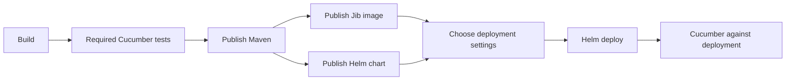

# GitLab CI demo

A Java 25 Spring Boot application returns `hello world`. Run `./mvnw verify` from `ci/java` to build and test without GitLab.

**Start here:** copy the [application CI file](http://localhost:8929/root/hello-world/-/blob/main/.gitlab-ci.yml). Select a pinned CI library revision and supply your deployable Maven module. Application name, chart path and namespace default to the GitLab project name. There are no CI scripts in the application.

The application imports the shared New pipeline form and **one central [java-service.yml](pipelines/java-service.yml)**. That file shows the complete job order and release policy. [Organization settings](config/organization.yml) contain server addresses and task images; credentials stay in GitLab.

Pushes and merge requests start build/tests immediately. On protected `main`, the default flow also publishes and deploys. Before deployment, **configure-deploy** waits 10 seconds: leave it alone for defaults, or use **Unschedule** and choose a cluster and Helm user profile. Follow **deploy-dev** to Helm and Cucumber. The UI is [localhost:8090](http://localhost:8090); the backend remains [localhost:8080/hello](http://localhost:8080/hello).

For an additional test run, open **test-custom**, choose the complete Cucumber suite or `@smoke`, and run it. The mandatory **test** always runs the complete suite. Choose **validate**, **publish** or **deploy** on **New pipeline**; this determines the job graph before execution. See [pipeline choices and redeployment](docs/pipeline-options.md).

A successful full main pipeline offers **release** in the same graph. Its default version is the next patch. The release flow rebuilds, validates and publishes immutable release artifacts, deploys to dev, tests them and records the GitLab release. See [release policy](docs/releases.md).

The ordinary pipeline, deployment child and release child all use the same central YAML. A child is an execution boundary, not another configuration wrapper: deployment holds a shared lock until its HTTP test finishes; release starts after a version has been reserved.

**Active modules:** `templates/` contains the thirteen modules used by the Java + Angular demo. The twelve unused modules are parked in [modules/todo/](modules/todo/) for future evaluation. The custom continuation component has been removed.

Active modules remain independently usable, each with its own image, inputs, outputs and hooks. Start with [required inputs and defaults](docs/inputs.md); the full [module catalogue](docs/reference.md) and [hook contract](docs/hooks.md) are reference material. Shared lifecycle handling is in [shared/module.yml](shared/module.yml), whose comments explain `!reference`.

We assess changes against standards and established practice, and explain deliberate deviations. The ten-second choice window and automatic patch policy are our choices, not universal CI standards. See [standards and decisions](docs/reuse-and-standards.md).
