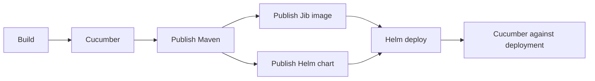

# GitLab CI demo

A Java 25 Spring Boot application returns `hello world`. Its pipeline builds, tests, publishes and deploys it using small reusable YAML modules.

Start with the [hello-world application](http://localhost:8929/root/hello-world). Run `./mvnw verify` from `ci/java` to build and test without GitLab. To see CI, open [Pipelines](http://localhost:8929/root/hello-world/-/pipelines), choose **New pipeline**, select `main`, and run it. Pushing a commit also starts the pipeline.

The deployed endpoint is [localhost:8080/hello](http://localhost:8080/hello).

The central strategy composes these build and deployment modules:

| Module | What it does |
|---|---|
| [maven-build](templates/maven-build.yml) | Package the application |
| [cucumber-test](templates/cucumber-test.yml) | Test the HTTP endpoint, locally or after deployment |
| [maven-publish](templates/maven-publish.yml) | Publish Maven packages to GitLab |
| [jib-build](templates/jib-build.yml) | Publish the application image to local Artifactory |
| [helm-publish](templates/helm-publish.yml) | Publish the Helm chart to local Artifactory |
| [helm-deploy](templates/helm-deploy.yml) | Deploy that chart and image digest |

Each module chooses its own image. The application includes the organization profile at a pinned revision and supplies only its two required inputs. The central strategy owns job order, release policy and deployment orchestration.

**Four places to read:**

1. [Application pipeline](http://localhost:8929/root/hello-world/-/blob/main/.gitlab-ci.yml): include the [organization profile](config/java-service.yml) and supply only the library revision and deployable Maven module.
2. [Central strategy](pipelines/java-service.yml): define the build cycle and manual release button.
3. [A module](templates/maven-build.yml): declare inputs, choose an image, run one operation.
4. [Shared lifecycle](shared/module.yml): common setup, post-hook/output handling and cleanup. Its comments explain `!reference`.

Outputs pass the image digest, chart version and deployment URL between jobs through GitLab dotenv artifacts. Hooks remain available for other consumers; this application contains no CI scripts.

**Configuration stays small.** [config/organization.yml](config/organization.yml) holds shared server addresses and an image selection for each task. The [Java organization profile](config/java-service.yml) supplies local deployment settings and project-name conventions. Credentials stay in GitLab variables. Module defaults live in `spec:inputs`; the application sets no optional inputs. See [settings used by the sample](docs/defaults.md).

See [required inputs and optional defaults](docs/inputs.md) before configuring a module. A project can use just one module. Include its component, supply the required `image` and other inputs, and declare its stage. Shared hook handling is included automatically; organization settings and other modules are optional. A deployment module can receive its chart and image digest from any producer that supplies its inputs.

For details beyond this demo, use the [library reference](docs/reference.md) and [hook contract](docs/hooks.md).

For centrally managed builds and the manual release button, see the [shared release strategy](docs/releases.md). Applications include it and supply settings; they do not maintain CI scripts.
