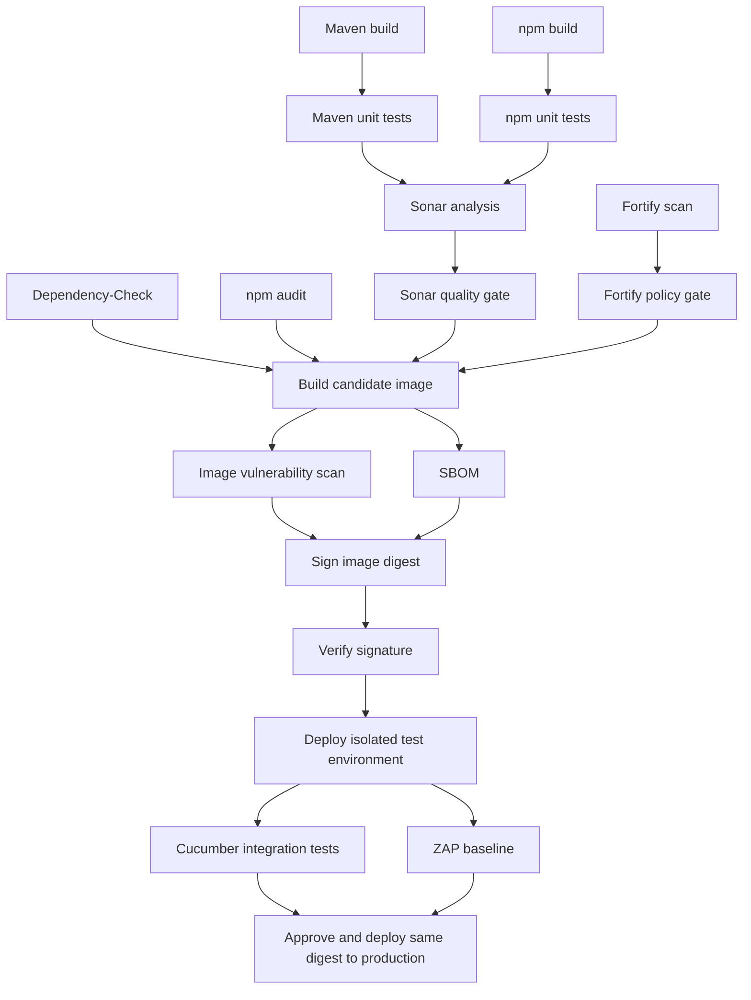

# Full library reference

For the small working demo, start with the [main README](../README.md). This page describes the optional broader library.

This starter targets GitLab CI. Each component owns one operation, declares its inputs, publishes named output variables and artifacts, and supports pre, post, and cleanup hooks. The application pipeline owns job ordering and environment promotion.

The working assumptions are GitLab CI and Helm deployment to Kubernetes. If GitHub is the source host, mirror the component repository into the GitLab instance running the pipeline: GitLab component references must use the same instance. If GitHub Actions is the intended execution platform, the contracts below still apply, but its adapters must use `workflow_call` inputs and job outputs instead of GitLab YAML. [GitLab components](https://docs.gitlab.com/ci/components/)

This is a starter, not an installed organization policy. Tool images, service credentials, application configuration, Fortify adapters, and deployment targets require organization-specific configuration. The local GitLab CE and runner setup is maintained separately in the workspace’s `infra/` directory.

The [Java 25 sample application](http://localhost:8929/root/hello-world) is a standalone multi-module Spring Boot project with Cucumber HTTP tests, Jib image builds, and a Helm chart. Its Maven build works independently of these CI components. The local Artifactory registry reproduces container publishing locally.

**Current decision: use our own components.** Each component is maintained directly in one YAML file under `templates/`. Standard vendor/GitLab components remain an option for future replacements; see [the reuse and standards assessment](reuse-and-standards.md). Parameterized delegation is described in [the hook contract](hooks.md).

## Design contract

- One component creates one job with one primary responsibility. Preparation needed for that operation stays with it; for example, an npm test job installs its locked dependencies.
- Configuration uses typed `spec:inputs`. Each component requires a tool image; pin the approved image to a digest when configuring your organization.
- Runtime values use namespaced dotenv outputs. Files and reports use normal artifacts. A downstream job explicitly imports its producers using `needs: {job: ..., artifacts: true}`.
- A successful operation and successful post hook publish outputs. Failure stops the job and prevents success outputs. Required scanners and gates fail on scanner errors and timeouts.
- Hooks are repository-relative POSIX shell scripts executed with `sh`, without `eval`. They run in subprocesses: use files to communicate; exports and directory changes do not propagate to the component shell.
- Each component includes its common lifecycle from `shared/module.yml` in the same repository revision. GitLab resolves this YAML without checking out library scripts. Hook and adapter paths refer to the **consuming application repository**.
- Job names and output prefixes are configurable so a component can be used more than once. Keep prefixes unique within a pipeline.

## Inputs, outputs, and hooks

Every component accepts `job-name`, `stage`, `image`, `job-timeout`, `artifact-expire-in`, `working-directory`, `output-prefix`, `pre-hook`, `post-hook`, `cleanup-hook`, and `hook-parameters-json`, plus its operation-specific inputs. Defaults and types are in its `spec:inputs` header. JSON parameters are exposed through `CI_MODULE_PARAMETERS_FILE`.

The optional [organization profile](../examples/full-pipeline/profile.yml) supplies a separate image for each job and common operational defaults through those inputs. Applications can override the profile's inputs or consume individual modules directly. See [defaults and profiles](organization-profile.md) for the ownership and override rules.

Every component exports `<PREFIX>_STATUS=passed`, `<PREFIX>_COMMIT_SHA`, and `<PREFIX>_PIPELINE_ID`, followed by operation-specific outputs. Outputs are stored under `.ci-output/<job-name>/outputs.env` and declared as `artifacts:reports:dotenv`.

| Hook | Execution | Failure behavior |
|---|---|---|
| `pre-hook` | Before the operation | Fails the job; operation does not run |
| `post-hook` | After a successful operation, before outputs are published | Fails the job |
| `cleanup-hook` | GitLab `after_script`, including supported failure/cancellation cases | Best effort; cannot change a successful job to failed |

Cleanup runs in a fresh shell. It is not guaranteed after runner termination or every timeout, so essential cleanup needs an external expiry/reconciliation mechanism. A mandatory check belongs in a component or post hook. [GitLab `after_script`](https://docs.gitlab.com/ci/yaml/#after_script)

Dotenv outputs exist at **job runtime**. They cannot drive `include`, `spec:inputs` validation, job names, stages, or `rules`, which are evaluated earlier. Inputs ending in `-variable` contain the **name** of an upstream runtime variable, which the component reads when it runs. Do not put secrets in dotenv artifacts. Reserve output names: project/group/pipeline variables can override dotenv values. [GitLab dotenv variables](https://docs.gitlab.com/ci/variables/dotenv_variables/)

Hooks are trusted application code, not a security boundary. Protect the component repository, consumer CI/hook files, protected runners, credentials, and deployment environments. Required organization policy must be enforced through platform settings or centrally managed pipeline policies as appropriate for your GitLab edition.

## Component catalogue

| Component | Responsibility | Additional outputs with default prefix |
|---|---|---|
| `maven-build` | Package Java artifacts | `MAVEN_BUILD_ARTIFACT_ROOT` |
| `maven-publish` | Publish reactor artifacts to a Maven repository | `MAVEN_PUBLISH_REPOSITORY_URL` |
| `maven-test` | Surefire unit tests and configured JaCoCo report | `MAVEN_TEST_REPORT_ROOT` |
| `npm-build` | Build locked npm project | `NPM_BUILD_ARTIFACT_DIR` |
| `npm-test` | Run the application's CI unit-test script | `NPM_TEST_REPORT_DIR` |
| `sonar-scan` | Submit Maven/Java analysis and coverage | `SONAR_SCAN_TASK_FILE` |
| `sonar-gate` | Await that analysis and enforce its Sonar gate | `SONAR_GATE_ANALYSIS_ID`, `SONAR_GATE_RESULT` |
| `dependency-check` | OWASP Dependency-Check for Maven dependencies | `DEPENDENCY_CHECK_REPORT_DIR` |
| `npm-audit` | Audit npm dependencies | `NPM_AUDIT_REPORT` |
| `fortify-scan` | Run the selected Fortify edition's scan adapter | `FORTIFY_SCAN_RECEIPT` |
| `fortify-gate` | Enforce policy on that exact scan receipt | `FORTIFY_GATE_REPORT` |
| `jib-build` | Build and publish a Java OCI image using Jib | `JIB_BUILD_IMAGE_REF`, `JIB_BUILD_IMAGE_REPOSITORY`, `JIB_BUILD_IMAGE_DIGEST` |
| `helm-publish` | Package and publish a versioned OCI Helm chart | `HELM_PUBLISH_REF`, `HELM_PUBLISH_VERSION` |
| `image-build` | Build and push one candidate OCI image | `IMAGE_BUILD_IMAGE_REF`, `IMAGE_BUILD_DIGEST` |
| `image-scan` | Scan the candidate image for vulnerabilities | `IMAGE_SCAN_REPORT` |
| `sbom` | Inventory the candidate image in CycloneDX format | `SBOM_REPORT` |
| `image-sign` | Sign the candidate digest using Cosign | `IMAGE_SIGN_IMAGE_REF` |
| `image-verify` | Verify its signature using the approved public key | `IMAGE_VERIFY_IMAGE_REF` |
| `helm-deploy` | Deploy a verified digest into one environment | `HELM_DEPLOY_URL`, `HELM_DEPLOY_IMAGE_REF`, `HELM_DEPLOY_RELEASE`, `HELM_DEPLOY_NAMESPACE` |
| `cucumber-test` | Run Failsafe/Cucumber locally or against a deployed URL | `CUCUMBER_TEST_REPORT_ROOT`, `CUCUMBER_TEST_TARGET_URL` |
| `zap-baseline` | Run a ZAP passive baseline scan of the deployment | `ZAP_BASELINE_REPORT_DIR`, `ZAP_BASELINE_TARGET_URL` |
| `handoff` | Delegate work to a script that explicitly calls `next` | `HANDOFF_WORK_VALUE`, `HANDOFF_NEXT_CALLED` |

Each component's `STATUS` is informational. The GitLab job exit status and required dependency graph enforce the workflow. Do not implement promotion by checking a caller-supplied `STATUS=passed` variable.

## Local application integration

The [hello-world pipeline](http://localhost:8929/root/hello-world/-/blob/main/.gitlab-ci.yml) imports the shared input form and one central [java-service.yml](../pipelines/java-service.yml) at an immutable commit. The central file composes build, required tests, optional developer tests, publication, deployment and release. It also defines the child flows; there is no separate organization-profile or delivery wrapper.

The application supplies its deployable module and declarative Helm values. CI scripts, job order, hooks and release policy remain in the library. Modules can still be consumed individually by other projects. The broader scanner/signing examples require their services and policies before adoption.

## Pipeline composition



The consumer example in `examples/full-pipeline/application.gitlab-ci.yml` includes the organization profile and shows explicit job dependencies and output handoffs. It assumes a Maven service at `backend/`, an npm project at `frontend/`, a Dockerfile that copies their build artifacts, and a chart at `helm/application/`. Adapt these paths through profile inputs. For independent services use separate pipelines or repeat components with unique names/prefixes.

Build the candidate image once, then scan, sign, verify, and promote the **same digest**. The initial registry push is a candidate upload, not permission to release. Production must depend on both Cucumber and ZAP success; a Helm readiness check alone does not establish application correctness.

## Organization baseline

1. Version component contracts with semantic versions and consume immutable commit SHAs. Review changes with platform/security ownership. Test a candidate component against representative Java, npm, and deployment repositories before releasing it.
2. Commit the Maven Wrapper and its distribution checksum, pin plugins and dependencies, and use approved artifact repositories. Use `npm ci` with the committed lockfile. Cache downloaded dependencies only as an optimization; transfer required build outputs as artifacts. [npm CI](https://docs.npmjs.com/cli/v11/commands/npm-ci/)
3. Configure Surefire for unit tests, JaCoCo for coverage, and Failsafe for integration tests. Run Failsafe's `verify` phase so test failures fail CI. Configure test discovery to fail when an expected suite contains no tests. [Maven Failsafe](https://maven.apache.org/surefire/maven-failsafe-plugin/)
4. Set the Sonar quality gate centrally. A suggested starting policy is at least 80% coverage on new code, no new blocker/critical issues, and reviewed security hotspots; tailor it to application risk. These numbers are organization policy suggestions, not universal industry requirements.
5. Fail dependency/image checks at the agreed severity (the starter uses high/critical or CVSS 7). Maintain reviewed, time-limited exceptions with an owner and remediation date. Cache/mirror vulnerability feeds with a defined freshness requirement. Dependency-Check's default threshold otherwise does not block vulnerabilities, so set it explicitly. [Dependency-Check configuration](https://dependency-check.github.io/DependencyCheck/dependency-check-maven/check-mojo.html)
6. Use Fortify for SAST and a defined security policy, alongside Sonar's maintainability/quality controls. Select SSC/ScanCentral or Fortify on Demand before writing the adapter; their authentication and scan APIs differ. Fortify's bundled `check-policy` action is a sample to tailor, not a universal policy. [Fortify actions](https://fortify.github.io/fcli/latest/ssc-actions.html)
7. Generate an SBOM, sign the immutable image, and verify its signature before deployment. Use KMS-backed signing or an approved OIDC trust setup. Configure cluster admission enforcement too; a CI verification job alone cannot prevent out-of-band deployment. [Cosign KMS signing](https://docs.sigstore.dev/cosign/key_management/overview/)
8. Use isolated test namespaces, minimal cluster RBAC, a Helm timeout and rollback behavior, protected production environments, authorized approvers, and deployment serialization. Credentials should be short-lived and scoped by job/environment. Keep untrusted merge-request jobs away from release credentials and protected deployment runners.
9. Treat OWASP as guidance and verification requirements. Dependency-Check covers known vulnerable dependencies; ZAP baseline covers a limited passive runtime scan. Add authenticated active/API DAST where appropriate, plus secrets scanning, IaC checks, license policy, and threat modeling. A passing scan does not establish OWASP ASVS compliance. [OWASP ASVS](https://owasp.org/www-project-application-security-verification-standard/), [NIST SSDF](https://csrc.nist.gov/pubs/sp/800/218/final)

## Configure before running

- Publish this repository to your GitLab instance, then replace example `platform/ci-components` references and `REPLACE_WITH_COMMIT_SHA` with the actual project and immutable revision.
- Supply digest-pinned image variables listed in `docs/setup.md`. Images need POSIX `sh` plus the named tools. Components intentionally do not download tooling during the job.
- Configure Maven test/coverage profiles, npm CI test reporters, a chart that supports image digests, and the Fortify adapters described in `docs/fortify-adapters.md`.
- Add secrets through your secret manager or appropriately protected GitLab variables, never through component inputs or output artifacts.
- Configure GitLab merge/deployment protections and run GitLab CI Lint on the fully resolved consumer pipeline in your own instance.
- Run `python3 -m unittest discover -s tests -p 'test_*.py'` locally. The tests read the component YAML directly and require Python 3 and Ruby's standard YAML library. These checks do not replace live scanner, runner, registry, and Kubernetes validation.

## Maintaining and replacing components

Edit each `templates/<component-name>.yml` directly. Each file contains its own input declarations, job image, operation, and output artifacts. Shared setup, post-hook/output validation, and cleanup live once in [`shared/module.yml`](../shared/module.yml). There is no generation step. For example:

```text
shared/
  module.yml
templates/
  maven-build.yml
  maven-test.yml
  npm-build.yml
  npm-test.yml
  sonar-scan.yml
  sonar-gate.yml
  helm-deploy.yml
  handoff.yml
  ...
```

The application pipeline consumes the public component name and contract. Keep input names/types, output names and meanings, artifact paths, hook behavior, image requirements, and failure behavior stable when changing an implementation. The consumer owns the dependency graph.

Components load the shared file with `include:local` and select its three sections with `!reference`. The post-hook remains at the end of `script`, where failure fails the job; `after_script` is reserved for cleanup. `image-build` removes its temporary registry credential before calling shared cleanup. Application `extends` configurations remain available for job defaults. Consume one component-library revision per pipeline because the shared hidden job name is common to all modules. [GitLab YAML references](https://docs.gitlab.com/ci/yaml/yaml_optimization/#reference-tags), [local includes](https://docs.gitlab.com/ci/yaml/#includelocal).

If we adopt a standard component later, use its supported extension points or a small adapter to preserve this contract. Validate the replacement against the existing contract checks and representative applications. Any incompatible contract change requires a new major version and an explicit consumer migration; upstream components are not assumed to be interchangeable automatically.
