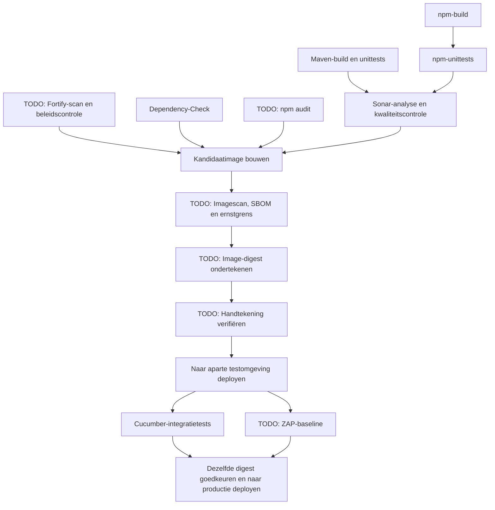

# Uitgebreid naslagwerk van de bibliotheek

Begin voor een eigen pipeline met de [modulehandleiding](modules.md) en [uitvoerbare voorbeelden](../examples/samples/README.md). Dit naslagwerk beschrijft outputs en geavanceerde mogelijkheden, ook van toekomstige modules. De standaardpipeline voor Java is optioneel.

Deze bibliotheek is bedoeld voor GitLab CI. Elke component voert één herkenbare taak uit, declareert inputs, publiceert benoemde outputvariabelen en artifacts en ondersteunt pre-, post- en cleanup-hooks. De applicatiepipeline bepaalt de jobvolgorde en promotie naar omgevingen.

Het uitgangspunt is GitLab CI met Helm-deployment naar Kubernetes. Staat de broncode op GitHub, spiegel de componentrepository dan naar de GitLab-instance die de pipeline uitvoert: componentreferenties moeten dezelfde instance gebruiken. Voor GitHub Actions kunnen dezelfde functionele afspraken gelden, maar zijn adapters met `workflow_call`-inputs en joboutputs nodig. Zie [GitLab-componenten](https://docs.gitlab.com/ci/components/).

De bibliotheek is een startpunt, geen volledig ingericht organisatiebeleid. Images, toegangsgegevens, applicatieconfiguratie, Fortify-adapters en deploymentdoelen vereisen eigen instellingen. De lokale GitLab CE- en runnerinrichting wordt apart beheerd in `infra/` in de werkmap.

De [Java 25-sample](http://localhost:8929/root/hello-world) is een zelfstandig Spring Boot-project met meerdere Maven-modules, Cucumber-HTTP-tests, Jib-imagebuilds en een Helm-chart. De Maven-build werkt ook zonder deze CI-componenten. De lokale Artifactory-registry bootst imagepublicatie na.

**Huidige keuze: eigen componenten gebruiken.** Actieve componenten staan als afzonderlijke YAML-bestanden in `templates/`. Ongebruikte modules staan in `modules/todo/` voor latere beoordeling. Standaardcomponenten van GitLab of leveranciers blijven een optie; zie [hergebruik en standaarden](reuse-and-standards.md). Gebruik voor uitbreidingen [GitLab-jobafhankelijkheden en kleine componenthooks](hooks.md).

## Ontwerpafspraken

- Eén component vertegenwoordigt één herkenbare taak voor de afnemer. De huidige modules maken ieder één job, maar dat is geen verplichting voor toekomstige componenten. Splits alleen op als zelfstandig gebruik, toegangsrechten of uitvoeringsmomenten dat rechtvaardigen. Benodigde voorbereiding hoort bij de taak; een npm-testjob installeert bijvoorbeeld zijn vastgelegde dependencies.
- Configuratie gebruikt getypeerde `spec:inputs`. Elke component vereist een tool-image. Zet goedgekeurde images bij de organisatie-inrichting vast op digest.
- Waarden uit jobs worden doorgegeven als dotenv-outputs met een eigen prefix. Bestanden en rapporten zijn gewone artifacts. Een vervolgjob haalt de outputs expliciet op met `needs: {job: ..., artifacts: true}`.
- Outputs worden gepubliceerd nadat de bewerking en post-hook slagen. Een fout stopt de job en voorkomt succesoutputs. Verplichte scanners en gates falen ook bij toolfouten en timeouts.
- Hooks zijn POSIX-shellscripts met een pad relatief aan de repository. Ze worden met `sh` uitgevoerd, zonder `eval`. Ze draaien als subprocessen: gebruik bestanden voor overdracht. Exports en wijzigingen van de werkmap worden niet overgenomen door de componentshell.
- Elke component laadt de gedeelde lifecycle uit `shared/module.yml` van dezelfde bibliotheekversie. GitLab verwerkt deze YAML zonder bibliotheekscripts uit te checken. Hook- en adapterpaden verwijzen naar de **repository van de afnemende applicatie**.
- Jobnamen en outputprefixen zijn instelbaar, zodat een component vaker kan worden gebruikt. Houd prefixen uniek binnen een pipeline.

## Inputs, outputs en hooks

Elke component accepteert `job-name`, `stage`, `image`, `job-timeout`, `artifact-expire-in`, `working-directory`, `output-prefix`, `pre-hook`, `post-hook`, `cleanup-hook` en `hook-parameters-json`, plus taakspecifieke inputs. Standaardwaarden en typen staan in `spec:inputs`. JSON-parameters zijn beschikbaar via `CI_MODULE_PARAMETERS_FILE`.

Het optionele [organisatieprofiel](../examples/full-pipeline/profile.yml) geeft elke job een aparte image en gedeelde uitvoeringsinstellingen. Applicaties kunnen profielinputs aanpassen of losse modules gebruiken. Zie [standaardwaarden en profielen](organization-profile.md) voor verantwoordelijkheden en overrides.

Elke component publiceert `<PREFIX>_STATUS=passed`, `<PREFIX>_COMMIT_SHA` en `<PREFIX>_PIPELINE_ID`, gevolgd door taakspecifieke outputs. Deze staan in `.ci-output/<job-name>/outputs.env`, gedeclareerd als `artifacts:reports:dotenv`.

| Hook | Uitvoering | Gevolg bij fouten |
|---|---|---|
| `pre-hook` | Vóór de bewerking | De job faalt; de bewerking start niet |
| `post-hook` | Na een geslaagde bewerking, vóór publicatie van outputs | De job faalt |
| `cleanup-hook` | In GitLabs `after_script`, ook bij ondersteunde fouten en annuleringen | Opruimen naar beste vermogen; maakt een geslaagde job niet alsnog rood |

Cleanup draait in een nieuwe shell. Uitvoering is niet gegarandeerd na het stoppen van een runner of bij iedere timeout. Essentieel opruimen vereist daarom ook een extern mechanisme voor verloop of herstel. Een verplichte controle hoort in een component of post-hook. Zie [GitLab after_script](https://docs.gitlab.com/ci/yaml/#after_script).

Dotenv-outputs ontstaan **tijdens de jobuitvoering**. Ze kunnen geen `include`, `spec:inputs`-validatie, jobnamen, stages of `rules` bepalen; die worden eerder verwerkt. Inputs die eindigen op `-variable` bevatten de **naam** van een aangeleverde variabele, die de component tijdens uitvoering leest. Zet geen geheimen in dotenv-artifacts. Reserveer de outputnamen: project-, groeps- en pipelinevariabelen kunnen dotenv-waarden overschrijven. Zie [dotenv-variabelen](https://docs.gitlab.com/ci/variables/dotenv_variables/).

Hooks zijn vertrouwde applicatiecode en vormen geen beveiligingsgrens. Bescherm de componentrepository, CI-/hookbestanden van afnemers, runners, toegangsgegevens en deploymentomgevingen. Dwing verplicht organisatiebeleid af via platforminstellingen of centraal beheerde pipelinepolicies die bij de GitLab-editie passen.

## Actieve componenten

De centrale Java-pipeline gebruikt de volgende vijftien modules uit `templates/`.

| Component | Verantwoordelijkheid | Aanvullende outputs met standaardprefix |
|---|---|---|
| `maven-build` | Java-artifacts bouwen en Surefire-unittests uitvoeren | `MAVEN_BUILD_ARTIFACT_ROOT` |
| `maven-publish` | Reactorartifacts naar een Maven-repository publiceren | `MAVEN_PUBLISH_REPOSITORY_URL` |
| `jib-build` | Een Java-OCI-image met Jib bouwen en publiceren | `JIB_BUILD_IMAGE_REF`, `JIB_BUILD_IMAGE_REPOSITORY`, `JIB_BUILD_IMAGE_DIGEST` |
| `helm-publish` | Een OCI-Helm-chart met versie verpakken en publiceren | `HELM_PUBLISH_REF`, `HELM_PUBLISH_VERSION` |
| `helm-deploy` | Een vastgelegde image-digest naar één omgeving deployen | `HELM_DEPLOY_URL`, `HELM_DEPLOY_IMAGE_REF`, `HELM_DEPLOY_RELEASE`, `HELM_DEPLOY_NAMESPACE` |
| `cucumber-test` | Failsafe/Cucumber lokaal of tegen een gedeployde URL uitvoeren | `CUCUMBER_TEST_REPORT_ROOT`, `CUCUMBER_TEST_TARGET_URL` |
| `npm-build` | Een npm-project met vastgelegde dependencies bouwen | `NPM_BUILD_ARTIFACT_DIR` |
| `npm-test` | Het CI-unittestscript van de applicatie uitvoeren | `NPM_TEST_REPORT_DIR` |
| `image-build` | Eén OCI-image vanuit een Dockerfile bouwen en publiceren | `IMAGE_BUILD_IMAGE_REF`, `IMAGE_BUILD_DIGEST` |
| `deployment-select` | Cluster-/gebruikerskeuzes voor deployment vastleggen | `SELECTION_CLUSTER`, `SELECTION_USER_CONFIG` |
| `release-reserve` | Een unieke versie met een Git-tag reserveren | `RELEASE_VERSION`, `RELEASE_TAG` |
| `release-check` | Gereserveerde tag, commit en nog vrije artifactlocaties controleren | `RELEASE_CHECK_VERSION`, `RELEASE_CHECK_TAG` |
| `gitlab-release` | Gevalideerde artifacts vastleggen als GitLab Release | `GITLAB_RELEASE_URL` |
| `sonar` | Maven/Java-analyse uitvoeren en op de quality gate wachten | `SONAR_TASK_FILE` |
| `dependency-check` | OWASP Dependency-Check op Maven-dependencies uitvoeren | `DEPENDENCY_CHECK_REPORT_DIR` |

Zie de [scanhandleiding](scanners.md) voor de gratis inrichting, uitvoeringsvoorwaarden en beperkingen.

## Modules voor toekomstig gebruik

De volgende zes modules staan in [modules/todo/](../modules/todo/) en worden niet door de Java-demo ingeladen. **Status: TODO voor alle onderstaande modules.** Ze zijn niet selecteerbaar in CI samples. Zie [resterend werk per module](modules.md#todo-nog-niet-actief). Hun contracttests blijven bestaan. Valideer de echte dienstintegraties voordat een module naar de actieve verzameling verhuist.

| Module | Beoogde verantwoordelijkheid | Aanvullende outputs met standaardprefix |
|---|---|---|
| `npm-audit` | npm-dependencies controleren | `NPM_AUDIT_REPORT` |
| `fortify` | Scannen en beleid toetsen aan precies die scan | `FORTIFY_RECEIPT`, `FORTIFY_REPORT` |
| `image-scan` | De kandidaatimage scannen, een CycloneDX-SBOM maken en de ernstgrens afdwingen | `IMAGE_SCAN_REPORT`, `IMAGE_SCAN_SBOM` |
| `image-sign` | De kandidaatdigest met Cosign ondertekenen | `IMAGE_SIGN_IMAGE_REF` |
| `image-verify` | De handtekening met de goedgekeurde publieke sleutel verifiëren | `IMAGE_VERIFY_IMAGE_REF` |
| `zap-baseline` | Een passieve ZAP-baselinescan op de deployment uitvoeren | `ZAP_BASELINE_REPORT_DIR`, `ZAP_BASELINE_TARGET_URL` |

De output `STATUS` is informatief. GitLabs exitcodes en verplichte jobafhankelijkheden bepalen het verloop. Gebruik een door de aanroeper ingestelde variabele `STATUS=passed` niet als basis voor promotie.

## Koppeling met de lokale applicatie

De [hello-world-pipeline](http://localhost:8929/root/hello-world/-/blob/main/.gitlab-ci.yml) neemt het gedeelde inputformulier en één centrale [java-service.yml](../pipelines/java-service.yml) op met een vaste uitgebrachte versie. Het centrale bestand combineert build, verplichte tests, optionele ontwikkeltests, publicatie, deployment en release. Ook de childvarianten staan daar; er is geen apart organisatieprofiel of delivery-omhulsel nodig.

De applicatie geeft de deploybare module en declaratieve Helm-values op. CI-scripts, jobvolgorde, hooks en releasebeleid blijven in de bibliotheek. Andere projecten kunnen de modules afzonderlijk gebruiken. De uitgebreidere scan-/signingvoorbeelden vereisen eerst hun diensten en beleid.

## Een pipeline samenstellen

Het onderstaande diagram toont het uitgebreide toekomstige referentievoorbeeld, inclusief modules uit `modules/todo/`. De actieve Java-demo voert deze volledige beveiligingsketen nog niet uit.



Het voorbeeld `examples/full-pipeline/application.gitlab-ci.yml` neemt het organisatieprofiel op en toont expliciete afhankelijkheden en overdracht van outputs. Het verwacht een Maven-service in `backend/`, een npm-project in `frontend/`, een Dockerfile die hun buildartifacts kopieert en een chart in `helm/application/`. Pas deze paden aan via profielinputs. Gebruik voor onafhankelijke services aparte pipelines of herhaal componenten met unieke namen en prefixen.

Bouw de kandidaatimage één keer. Scan, onderteken, verifieer en promoveer daarna **dezelfde digest**. De eerste registry-push biedt een kandidaat aan en geeft nog geen toestemming voor een release. Productie moet wachten op geslaagde Cucumber- én ZAP-controles. Alleen wachten op Helm-readiness toont niet aan dat de applicatie correct werkt.

## Basisafspraken voor de organisatie

1. Neem componenten op via een volledige uitgebrachte versie, zoals `1.0.0`, en bescherm de bijbehorende Git-tags. Laat platform-/beveiligingsverantwoordelijken wijzigingen beoordelen. Test een kandidaatcomponent op zijn exacte commit-SHA met representatieve Java-, npm- en deploymentrepositories vóór publicatie. Zie [componentversies](component-versions.md).
2. Commit de Maven Wrapper met distributiechecksum, zet plugins en dependencies vast en gebruik goedgekeurde artifactrepositories. Gebruik `npm ci` met de gecommitteerde lockfile. Caches versnellen downloads; vereiste buildoutputs worden als artifacts doorgegeven. Zie [npm ci](https://docs.npmjs.com/cli/v11/commands/npm-ci/).
3. Configureer Surefire voor unittests, JaCoCo voor coverage en Failsafe voor integratietests. Voer de Failsafe-fase `verify` uit, zodat testfouten CI laten falen. Laat een verwachte maar lege testsuite falen. Zie [Maven Failsafe](https://maven.apache.org/surefire/maven-failsafe-plugin/).
4. Stel de Sonar-quality-gate centraal in. Een mogelijk startbeleid is minstens 80% dekking op nieuwe code, geen nieuwe blocker-/critical-bevindingen en beoordeelde security hotspots. Stem dit af op het applicatierisico. Deze grenzen zijn beleidsvoorstellen, geen universele industrie-eisen.
5. Laat dependency-/imagecontroles blokkeren bij de afgesproken ernst; dit startpunt gebruikt high/critical of CVSS 7. Beheer beoordeelde, tijdelijke uitzonderingen met eigenaar en oplosdatum. Stel eisen aan de actualiteit van gecachete of gespiegelde kwetsbaarheidsfeeds. Dependency-Check blokkeert met zijn standaardgrens niet vanzelf op kwetsbaarheden; stel de grens expliciet in. Zie [Dependency-Check-configuratie](https://dependency-check.github.io/DependencyCheck/dependency-check-maven/check-mojo.html).
6. Gebruik Fortify voor SAST met vastgelegd beveiligingsbeleid, naast Sonars onderhoudbaarheids- en kwaliteitscontroles. Kies SSC/ScanCentral of Fortify on Demand vóór het schrijven van een adapter: authenticatie en scan-API's verschillen. Fortify's meegeleverde `check-policy` is een aan te passen voorbeeld. Zie [Fortify-acties](https://fortify.github.io/fcli/latest/ssc-actions.html).
7. Genereer een SBOM, onderteken de onveranderlijke image en verifieer de handtekening vóór deployment. Gebruik KMS-signing of goedgekeurd OIDC-vertrouwen. Dwing dit ook af bij toelating in het cluster; een CI-verificatiejob blokkeert geen deployments buiten CI. Zie [Cosign KMS-signing](https://docs.sigstore.dev/cosign/key_management/overview/).
8. Gebruik aparte testnamespaces, minimale cluster-RBAC, Helm-timeouts en rollback, protected productieomgevingen, bevoegde goedkeurders en deploymentlocks. Geef credentials een korte geldigheid en beperk ze tot job/omgeving. Houd onbetrouwbare MR-jobs gescheiden van releasecredentials en protected deploymentrunners.
9. Gebruik OWASP als richtlijn en bron van verificatie-eisen. Dependency-Check zoekt bekende kwetsbare dependencies; ZAP baseline doet een beperkte passieve runtimescan. Voeg waar nodig geauthenticeerde actieve/API-DAST, geheimenscans, IaC-controles, licentiebeleid en dreigingsmodellering toe. Geslaagde scans bewijzen geen OWASP ASVS-conformiteit. Zie [OWASP ASVS](https://owasp.org/www-project-application-security-verification-standard/) en [NIST SSDF](https://csrc.nist.gov/pubs/sp/800/218/final).

## Inrichten vóór uitvoering

- Publiceer de repository op je GitLab-instance. Gebruik in voorbeelden het eigen componentproject en een uitgebrachte versie; voor onze demo zijn dat `root/ci-components` en `1.0.0`.
- Stel de imagevariabelen uit `docs/setup.md` in op vaste digests. Images hebben POSIX `sh` en de genoemde tools nodig. Componenten downloaden tijdens een job geen tooling.
- Configureer Maven-test-/coverageprofielen, npm-CI-rapportage, een chart met ondersteuning voor image-digests en de Fortify-adapters uit `docs/fortify-adapters.md`.
- Beheer geheimen via een secretmanager of passend beschermde GitLab-variabelen, nooit via componentinputs of outputartifacts.
- Richt merge- en deploymentbescherming in. Voer GitLab CI Lint uit op de volledig samengevoegde pipeline van de afnemer in de eigen instance.
- Voer lokaal `python3 -m unittest discover -s tests -p 'test_*.py'` uit. De tests lezen de component-YAML rechtstreeks en vereisen Python 3 en Ruby's standaard YAML-library. Ze vervangen geen echte validatie van scanners, runners, registries en Kubernetes.

## Componenten onderhouden en vervangen

Bewerk actieve bestanden `templates/<component-name>.yml` rechtstreeks. Toekomstige modules staan in `modules/todo/`. Verplaats een module pas naar `templates/` als er een concrete afnemer is en de integratievalidatie klaar is. Elk bestand bevat zijn eigen inputdefinities, jobimage, bewerking en artifacts. Voorbereiding, post-hook-/outputcontrole en cleanup staan gedeeld in [`shared/module.yml`](../shared/module.yml). Een generatiestap is niet nodig.

```text
pipelines/java-service.yml   # jobvolgorde en beleid voor Java
shared/module.yml           # gedeelde joblifecycle
templates/                  # vijftien actieve modules
modules/todo/               # zes modules voor toekomstig gebruik
```

De applicatie gebruikt de openbare componentnaam en de bijbehorende afspraken. Houd bij implementatiewijzigingen inputnamen en -typen, outputnamen en -betekenis, artifactpaden, hookgedrag, imagevereisten en foutafhandeling stabiel. De afnemer bepaalt de jobafhankelijkheden.

Componenten laden het gedeelde bestand met `include:local` en kiezen de drie onderdelen met `!reference`. De post-hook blijft aan het einde van `script`, waar een fout de job laat falen. `after_script` is voor cleanup. `image-build` verwijdert eerst zijn tijdelijke registry-credentials en roept daarna de gedeelde cleanup aan. Applicaties kunnen `extends` gebruiken voor jobdefaults. Gebruik één bibliotheekversie per pipeline, omdat alle modules dezelfde verborgen job delen. Zie [GitLab-YAML-referenties](https://docs.gitlab.com/ci/yaml/yaml_optimization/#reference-tags) en [lokale includes](https://docs.gitlab.com/ci/yaml/#includelocal).

Als we later een standaardcomponent overnemen, gebruik dan de ondersteunde uitbreidingspunten of een kleine adapter om de afspraken te behouden. Test de vervanging met bestaande contracttests en representatieve applicaties. Onverenigbare wijzigingen vereisen een nieuwe majorversie en expliciete migratie van afnemers. Componenten van verschillende aanbieders zijn niet vanzelf uitwisselbaar.
